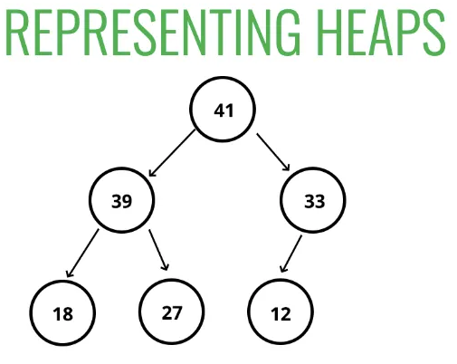
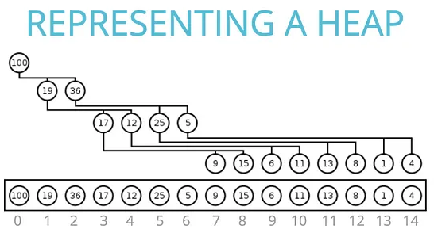

# API requests met priority queue

(c) 2024 Hogeschool Utrecht  
Auteurs: David Isaacs Paternostro en Tijmen Muller

* Studentnummer: 
* Naam: 
* Datum: 


## Installatie

Als er nog geen omgeving genaamd `ai-s2` is, creeer deze dan door in de Anaconda 
Prompt (`conda`) naar de directory van dit project te gaan en daar te typen:
```conda env create -f s2_ai_conda.yaml```

### Interpreter instellen in PyCharm
1. Ga naar File >> Settings >> Project: _projectnaam_ >> Project Interpreter en dan:
   1. kies ai-s2 in het dropdown menu; of
   2. ga naar Add Interpreter >> Add Local Interpreter >> Conda Environment >> 
      Use Existing Environment >> selecteer `ai-s2` in het dropdown menu.
2. Klik rechtsonder in de GUI waar je 'Python' ziet staan.

### Interpreter instellen in VSCode
1. Klik rechtsonder in de GUI waar je 'Python' ziet staan. Er komt midden bovenin je
   scherm een dropdown menu, kies daar: `ai-s2`.


## Vooronderzoek

Er zijn twee belangrijke functies te onderscheiden in een _priority queue_:

- het toevoegen van een nieuwe waarde (bijvoorbeeld een prioriteit);
- het opzoeken (en verwijderen) van de kleinste waarde (c.q. de hoogste prioriteit).

Een naieve implementatie kan gewoon gebruik maken van een standaard Python `list`,
waarbij je waardes `append` en door de lijst zoekt naar de hoogste prioriteit.
Een slimmere aanpak is om een _minheap_ te gebruiken, die in Python beschikbaar
is als de module `heapq`.

1. Gebruik `simulate.py` om te onderzoeken hoe lang bovengenoemde twee functies 
duren in het geval van het gebruik van een standaard Python `list` en bij gebruik
van de Python library `heapq`. Simuleer dit met verschillende waarden voor
probleemgrootte _n_.

> Geef hier je antwoord.


2. Wat kun je zeggen over de complexiteit van de algoritmes voor de `list` en
van `heapq` op basis van de uitkomsten van je onderzoek?

> Geef hier je antwoord.


## Implementatie

3. Implementeer de _minheap_ datastructuur door de functies in `priority_queue.py`
te implementeren. Gebruik de tests in `test_priority_queue.py` om je eigen code
te testen. Je mag geen externe modules van Python gebruiken voor je implementatie.

### Aanpak

* Vul de functies in de module `priority_queue` zodanig in dat de tests slagen.
* Begin met de simpelste functies en bouw langzaam naar `push()`, `pop()` en `from_list()`.
* Maak gebruik van onderstaande illustraties om een idee te krijgen hoe je een heap
  kan vertalen naar een Python list. Je kan de volgende formules gebruiken om in een
  lijst de _parents_ en _children_ te vinden.  
  Gegeven index `i`:
  * `parent(i) = floor((i - 1) / 2)`
  * `left_child(i) = 2 * i + 1`
  * `right_child(i) = 2 * i + 2`




## Analyse

4. Geef een complexiteitsanalyse van onderstaande functies. Beredeneer tot welke klasse
van complexiteit de functie behoort en leg duidelijk uit waarom.

* `priority_list.push()`

> Geef hier je analyse.


* `priority_list.pop()`

> Geef hier je analyse.


* `priority_queue.push()`

> Geef hier je analyse.


* `priority_queue.pop()`

> Geef hier je analyse.


* `priority_queue.from_list()`

> Geef hier je analyse.


## Experiment

Doe een empirisch onderzoek door de simulaties, zoals uitgevoerd bij vraag 1., te herhalen voor je eigen implementatie.

5. Wat waren de resultaten van je simulatie?

> Geef hier je antwoord.

6. Komen de resultaten overeen met hetgeen je mag verwachten gegeven de gevonden
   complexiteiten uit vraag 4.? Verklaar eventuele verschillen.

> Geef hier je antwoord.

7. Heeft jouw implementatie dezelfde complexiteit als de implementatie van `heapq`?
   Is jouw implementatie net zo _snel_ als de implementatie van `heapq`?
   Verklaar eventuele verschillen.

> Geef hier je antwoord.

8. Welke mogelijkheden zie je om je implementatie (nog) efficiënter te maken?

> Geef hier je antwoord.
